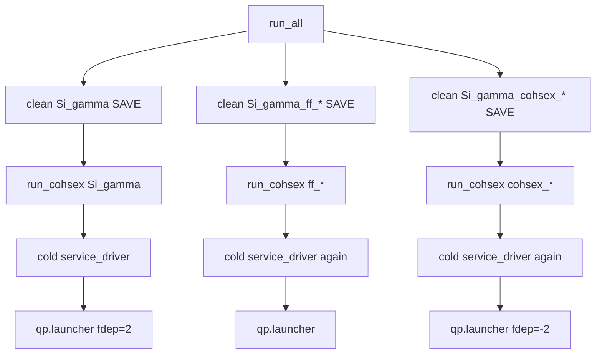
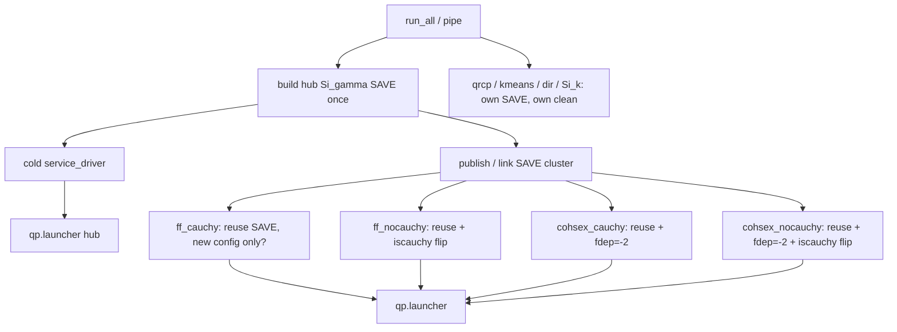

# `example/` run pipeline

This document describes the **current** `run_all` / `run_cohsex` pipeline in detail, and marks where SAVE reuse among Si_gamma* cases can cut wall time.

Edit the **Planned steps** section below with what you want next; implementation follows that.

---

## 1. Entry points

| Script | Role |
|--------|------|
| `run_all.m` | Orchestrate verification cases under `cases/` |
| `run_cohsex.m` | Per-case: `input_driver` → `qp.launcher` (name contains `gamma`, or any COHSEX/FF case) |
| `run_gw_x.m` | Per-case: `input_driver` → `gw.x` (e.g. `Si_k`) |
| `clean_case_outputs.m` | Wipe `SAVE/`, `isdf_report/`, `qp_*.dat`, `r-*.log`, `l-*.log` |
| `collect_qp_energies.m` | Parse `qp*.dat` → table / CSV (post-run) |
| `collect_qp_dat.sh` | Copy `qp*.dat` → `example/result/<case>/` |

Typical MATLAB session:

```matlab
cd <repo>/example
run_all
collect_qp_energies
% optional: !./collect_qp_dat.sh
```

---

## 2. Case inventory (`cases/`)

Eight Si_gamma* folders + others:

| Case | GS | Distinct knobs (vs `Si_gamma`) | Shares GS with hub? |
|------|----|--------------------------------|---------------------|
| `Si_gamma` | `./qe.save` | hub: `exxmethod=pseudo`, `fdep=2`, `iscauchy=true` | hub |
| `Si_gamma_ff_cauchy` | `../Si_gamma/qe.save` | prefix only (same physics as hub) | yes |
| `Si_gamma_ff_nocauchy` | same | `iscauchy=false` | yes |
| `Si_gamma_cohsex_cauchy` | same | `fdep=-2`, `iscauchy=true` | yes |
| `Si_gamma_cohsex_nocauchy` | same | `fdep=-2`, `iscauchy=false` | yes |
| `Si_gamma_qrcp` | same | `exxmethod=qrcp` | GS only (ISDF rebuild) |
| `Si_gamma_kmeans` | same | `exxmethod=kmeans` | GS only (ISDF rebuild) |
| `Si_gamma_dir` | same | `isisdf=0` (dense) | GS only (no ISDF) |

**Shareable SAVE cluster (your 5):**

```text
Si_gamma
Si_gamma_ff_cauchy
Si_gamma_ff_nocauchy
Si_gamma_cohsex_cauchy
Si_gamma_cohsex_nocauchy
```

Same GS, same ISDF method (`pseudo`), same cutoffs/system. Differ only in:

- `CONTROL.prefix`
- `FREQUENCY.frequency_dependence` (`2` vs `-2`)
- `ISDF.iscauchy` (`.true.` / `.false.`)

`qrcp` / `kmeans` / `dir` intentionally do **not** share ISDF products with the hub.

Also in `run_all` (when enabled): `Si_k` → `run_gw_x`.

---

## 3. `run_all` orchestration (as coded today)

```text
run_all
  for each case in list:
    1. clean_case_outputs(case_dir)     %% ALWAYS wipes SAVE/
    2. if name ~ /gamma/ → run_cohsex(case_dir)
       else             → run_gw_x(case_dir)
  summary ok/fail
```

Implications for the shareable cluster:

- Every case pays full `service_driver` cold cost (system / symmetry / FFT / wave_functions + ISDF).
- Existing `input_driver` stage cache (`SAVE/relay_stage.mat`) is useless across cases because `clean_case_outputs` deletes `SAVE/` first.
- Even within one case directory, a second run can hit the stage cache; `run_all` never does that across the five folders.

---

## 4. Per-case pipeline: `run_cohsex`

```text
run_cohsex(case_dir)
  ├─ require case_dir/test
  ├─ resolve CONTROL.groundstate_dir from namelist; check QE fingerprints
  ├─ cd gw_root; QPstartup; cd case_dir
  ├─ service_reset_persistent(); packages_reset_persistent()
  ├─ input_driver('./test')          %% builds SAVE/ + services
  ├─ load SAVE/config.mat → config
  └─ qp.launcher(config)             %% Ex + SX/CH → Eqp → qp.dat
```

Wall-clock prints: `input_driver+load` and `qp.launcher` separately.

### 4.1 `input_driver` (detail)

```text
input_driver(test)
  1. config ← read_input_param(test)
  2. validate_required_params(config)
  3. Cache gate: SAVE/relay_stage.mat AND SAVE/data.mat ?
       YES → load data.mat (skip load_groundstate_info)
       NO  → data ← load_groundstate_info(groundstate_dir, type, config)
  4. config ← set_default_param_value(config, data)   %% always rebuild config
  5. output.free(); display_input_summary(config)     %% opens r-<prefix>.log
  6. if fdep==2 → config ← generate_frequency(config)
  7. mkdir SAVE if needed
  8. config.ISDFCauchy ← setISDFCauchy(data, config)
  9. save SAVE/data.mat, SAVE/config.mat
 10. service_driver(data, config)
```

### 4.2 `service_driver` (detail) — main cost

```text
service_driver(data, config)
  parallel.driver(...)
  if SAVE/relay_stage.mat exists:          %% "warm" path
    relay.stage_from_db → relay.restore
    rebuild: lattice, coulomb, (isdf if isisdf)
    return
  else:                                    %% "cold" path (run_all today)
    system.driver
    symmetry.driver
    FFT.driver
    lattice.driver
    coulomb.driver
    wave_functions.driver                  %% heavy
    if isisdf: isdf.driver                 %% heavy (adaptive ISDF)
    relay.collect → save relay_stage.mat
```

**Cached in stage (data-derived):** system / symmetry / FFT / wave_functions (+ timing bits via relay).

**Always rebuilt from current config:** lattice / coulomb / ISDF.

So even with a shared stage, changing `exxmethod` / `isisdf` still rebuilds ISDF; changing only `fdep` / `iscauchy` / `prefix` can keep the expensive stage + largely reuse ISDF if ISDF knobs match.

### 4.3 `qp.launcher` (detail)

```text
qp.launcher(config)
  if fdep==2 and ~freqinfo → generate_frequency
  qp.summary(0)
  Ex:
    fdep ~= -2 → gw.x
    fdep == -2 → gw.x_Gamma
  SX/CH:
    -2 → gw.cohsex_Gamma
    -1 → gw.cohsex_multi_k
     2 → gw.fullfreq_cd_res_Gamma + gw.fullfreq_cd_int_Gamma
  Eqp = Ex + Esx_x + Ecoh
  qp.fout → qp.dat / qp_*.dat under case cwd
  qp.summary(1)
```

Outputs of interest for verification: `qp.dat` (and logs `r-<prefix>.log`).

---

## 5. What lives in `SAVE/`

| File | Meaning |
|------|---------|
| `data.mat` | Groundstate-derived `data` |
| `config.mat` | Full config (namelist + defaults + freqinfo / ISDFCauchy, …) |
| `relay_stage.mat` | Expensive service snapshot for warm `service_driver` |

ISDF objects also sit in persistent service state after `isdf.driver`; they are part of what makes cold `service_driver` expensive. Stage restore + ISDF rebuild policy is defined in `service_driver` (ISDF still runs when `isisdf` if stage hit).

Precedent for cross-case SAVE use: `run_sc.m` keeps `Si2_uc/SAVE` and points SC at it via namelist (`isdf_source_dir` / supercell path) — different mechanism, same idea (do not wipe the producer SAVE).

---

## 6. Cost model for the shareable 5

Today (`run_all` + clean every case):

```text
5 × (cold service_driver + qp.launcher)
```

Target (conceptual):

```text
1 × cold service_driver on hub (Si_gamma)
4 × cheap attach: reuse hub SAVE/stage (+ shared ISDF products)
    then only rebuild what must change (config / lattice? / coulomb? / Cauchy path)
    + qp.launcher with that case's fdep / iscauchy / prefix
```

Rough split of what **must** differ per case after a shared stage:

| Knob | Needs new cold ISDF? | Needs new `qp.launcher` path? | Notes |
|------|----------------------|-------------------------------|-------|
| `prefix` | no | no (I/O names only) | log / qp naming |
| `iscauchy` | ? (ISDFCauchy / χ path) | yes if it changes Σ | G3 showed Re Eqp0 identical in last result dump — flag may be inert or applied too late |
| `fdep` 2 vs −2 | no (same ISDF) | yes (FF vs COHSEX) | main physics fork |

`qrcp` / `kmeans` / `dir` remain full (or partial) rebuilds.

---

## 7. Current vs desired flow (mermaid)

### Current



### Desired (sketch — not implemented)



---

## 8. Related helpers (outside `run_all`)

| Piece | Notes |
|-------|------|
| `run_sc` | Already shares `Si2_uc/SAVE` → `Si8_sc` without wiping producer |
| `input_driver` stage hit | Per-directory warm path; requires `relay_stage.mat` + `data.mat` kept |
| `service_reset_persistent` | Called every `run_cohsex`; sharing SAVE still needs restore into memory via `relay.stage_from_db` / `service_driver` |

---

## 9. Planned steps (edit here)

> You fill this section. Implementation will follow these bullets only.

### 9.1 Sharing policy

- [ ] Which directory is the **SAVE producer**? (proposal: `cases/Si_gamma/SAVE`)
- [ ] How do consumers attach?
  - [ ] copy SAVE → each case
  - [ ] symlink `SAVE` → `../Si_gamma/SAVE`
  - [ ] namelist `storage_dir = '../Si_gamma/SAVE'`
  - [ ] other: _______________
- [ ] Do consumers still write their own `config.mat`, or overwrite hub config?
- [ ] Must `clean_case_outputs` **skip** wiping hub SAVE when running the cluster?

### 9.2 `run_all` / pipe ordering

- [ ] Fixed order: hub first, then ff_*, then cohsex_*, then independent cases
- [ ] Explicit “pipe groups” in `run_all` (not flat list)
- [ ] Optional flag: `run_all('share')` vs cold full clean

### 9.3 What to rebuild after attach

- [ ] Always: re-read namelist → fresh `config` (+ `generate_frequency` if fdep=2)
- [ ] Always / never: `setISDFCauchy` when `iscauchy` flips
- [ ] Always / never: re-run `isdf.driver`
- [ ] Always: `lattice` / `coulomb` (current stage-hit behavior)
- [ ] `qp.launcher` only for consumers

### 9.4 Cleaning & artifacts

- [ ] Hub: clean before build? keep SAVE after cluster?
- [ ] Consumers: clean logs/qp but keep/link SAVE
- [ ] Result collection: still per-case `qp.dat` under case dir / `example/result/`

### 9.5 Verification expectations

- [ ] Bitwise / numerical identity: `Si_gamma` vs `Si_gamma_ff_cauchy` when sharing
- [ ] G3 Cauchy on/off must actually differ once flag path is fixed
- [ ] Independent cases (`qrcp`, `kmeans`, `dir`) unchanged

### 9.6 Your additional steps

```text
1. Soft-link consumers SAVE → Si_gamma/SAVE
2. Batch: link + matlab run_all with profile on / profsave
```

Implemented (batch path):

| Piece | Role |
|-------|------|
| `link_shared_save.sh` | Cauchy cluster: full `SAVE` → `../Si_gamma/SAVE` |
| `link_isdf_checkpoints.sh` | G4 ratio cases: link `isdf_adaptive_checkpoint_*{vc,vn,nn}*` |
| `run_all_shared_save.sh` | SLURM: links then `matlab -batch run_all_profiled` |
| `run_all_profiled.m` | `profile on` → `run_all` → `profsave` → `profile_run_all/` |
| `clean_case_outputs.m` | Keep full-SAVE symlinks; ratio cases re-link ckpts after clean |
| `run_all.m` | Hub → cauchy → **162416_exact** → other 162416 → 161616 → independents |

G4 checkpoint rules:

- `162416*`: hub `*vc*` + `*nn*`; `*vn*` from `Si_gamma_162416_exact` (run exact first)
- `161616*`: all hub `isdf_adaptive_checkpoint_*`

```bash
cd example
mkdir -p log
sbatch run_all_shared_save.sh     # SLURM
# or interactive:
# bash run_all_shared_save.sh
```

On exit (success or failure) the SLURM/batch script runs `--unlink` for both
`link_shared_save.sh` and `link_isdf_checkpoints.sh`, then removes empty `SAVE/` dirs.

---

## 10. Implementation checklist

- [x] Batch link + profiled `run_all`
- [x] Symlink-safe `clean_case_outputs`
- [ ] Docs: sync `VERIFY_GROUPS.md`
- [ ] Smoke: hub + one ff + one cohsex wall-time vs five cold runs
